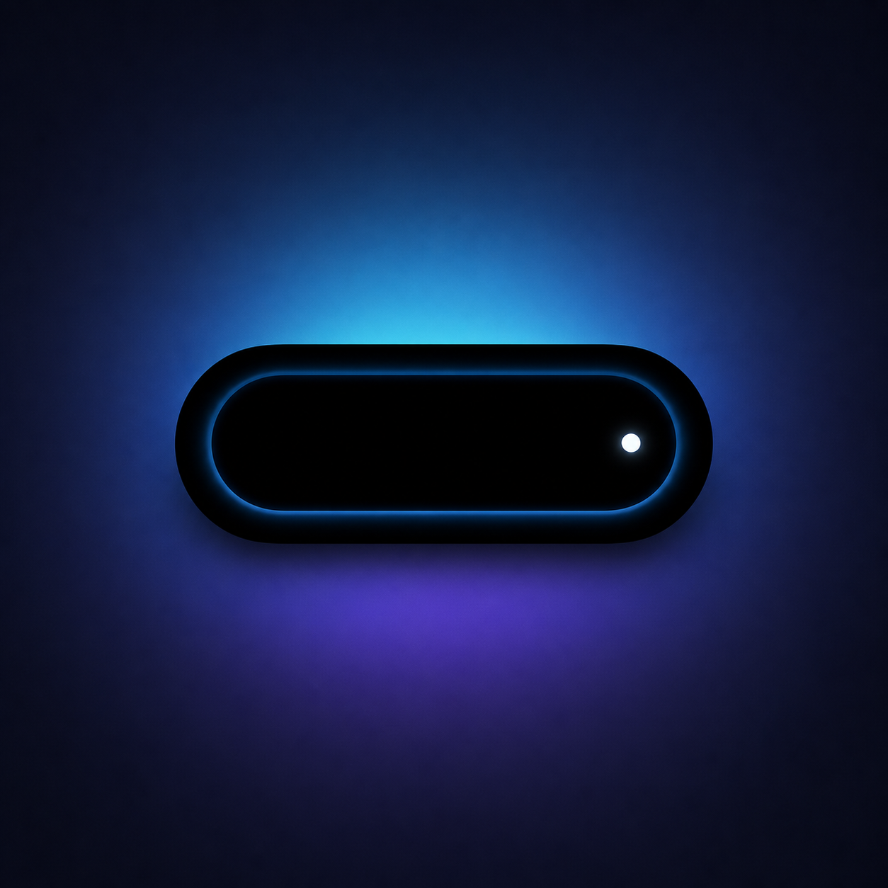
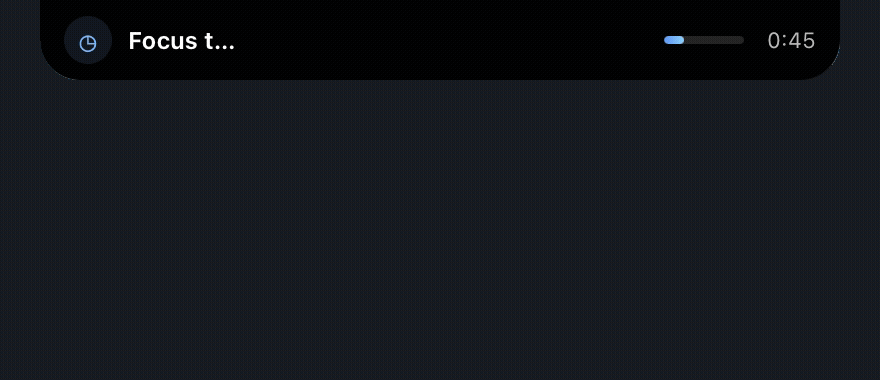
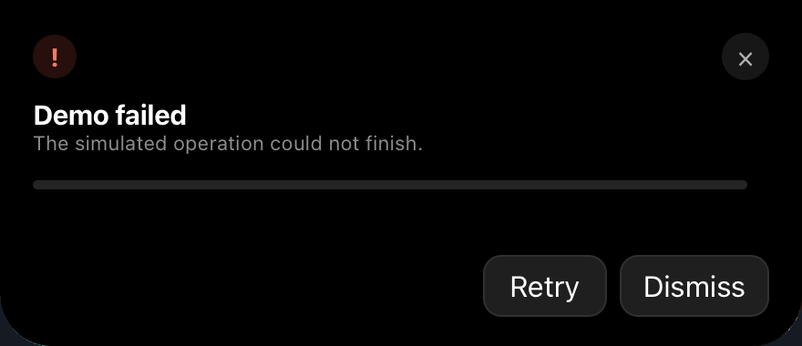

<p align="center">
  
</p>

<h1 align="center">Open Island</h1>

<p align="center">
  A notch-aware Dynamic Island–style activity overlay for macOS,<br>
  built in Rust with Tauri and Leptos.
</p>

<p align="center">
  <a href="#quick-start">Quick start</a>
  ·
  <a href="#demo-activities">Try the demos</a>
  ·
  <a href="docs/architecture.md">Architecture</a>
  ·
  <a href="docs/manual-test-checklist.md">Test checklist</a>
</p>

> [!IMPORTANT]
> Open Island is an early, demo-first implementation. It does not intercept system notifications, inspect other applications, access the microphone, or use private macOS activity events.

## Preview

<p align="center">
  
</p>

<p align="center">
  Compact at menu-bar level, then expanded downward for controls.
</p>

<details>
  <summary><strong>View still screenshots</strong></summary>
  <br>
  <p align="center">
    
  </p>
  <p align="center"><em>Compact recording activity</em></p>
  <br>
  <p align="center">
    
  </p>
  <p align="center"><em>Expanded failure activity with actions</em></p>
</details>

> [!NOTE]
> macOS screenshots omit the physical display notch. On notched MacBooks, Open Island is anchored at the top edge and wraps the captured UI around the real notch.

## What is Open Island?

Open Island turns the area around a MacBook notch—or the top center of any Mac display—into a lightweight activity surface.

It stays hidden until an activity appears, opens as a compact status strip at menu-bar level, and expands downward for details and actions. The native window remains above normal applications, follows macOS Spaces, and avoids stealing keyboard focus while compact.

## Highlights

| | |
| --- | --- |
| **Notch-aware layout** | Reads AppKit safe-area and auxiliary screen geometry instead of hardcoding Mac model identifiers. |
| **Native top-edge placement** | Uses AppKit positioning and window levels to sit beside the physical notch at menu-bar height. |
| **Compact → expanded motion** | Grows horizontally, drops downward, and preserves a stable top-center anchor. |
| **Focus-conscious behavior** | Compact mode stays non-key and non-focusable; expanded mode enables interaction temporarily. |
| **Multiple Spaces** | Uses conservative AppKit collection behavior for Spaces and full-screen auxiliary presentation. |
| **Local demo activities** | Includes timer, recording, download, meeting, notification, and failure states. |
| **Privacy-first scope** | No telemetry, accounts, filesystem access, shell access, notification scraping, or microphone capture. |
| **Rust across the stack** | Tauri owns native behavior, Leptos renders the UI, and a shared model crate keeps IPC types consistent. |

## Demo activities

Open Island starts hidden. Click its menu-bar icon to launch:

- **Timer** — a 60-second countdown with remaining time and progress
- **Recording** — an elapsed-time simulation with a stop action; no microphone is used
- **Download** — progresses over roughly 10 seconds, enters attention mode, then auto-dismisses
- **Notification** — a simple informational activity
- **Failure** — an error state with Retry and Dismiss actions

Click the compact island to expand it. Press <kbd>Esc</kbd> to collapse.

## Quick start

### Prerequisites

- macOS 11 or newer
- Rust and Cargo
- The `wasm32-unknown-unknown` Rust target
- [Trunk](https://trunkrs.dev/)
- Tauri CLI 2
- Xcode Command Line Tools

### Run locally

```bash
git clone https://github.com/open-dynamic-island/open-dynamic-island.git
cd open-dynamic-island

rustup target add wasm32-unknown-unknown
cargo install trunk --locked
cargo install tauri-cli --version "^2" --locked

cargo tauri dev
```

If your environment exports `NO_COLOR=1`, Trunk 0.21 expects a boolean string:

```bash
NO_COLOR=false cargo tauri dev
```

Once the app is running, use the new island-shaped menu-bar icon to start a demo.

## Build

```bash
cargo tauri build
```

The default bundle target is:

```text
target/release/bundle/macos/open-island.app
```

To request a DMG from an interactive Finder session:

```bash
cargo tauri build --bundles dmg
```

## How it works

```text
Menu-bar action
      │
      ▼
ActivityManager ──► pure reducer ──► IslandSnapshot
      │                                  │
      │ native effects                   │ typed Tauri event
      ▼                                  ▼
WindowController                    Leptos UI
      │                                  │
      └──── AppKit placement ◄── transition completion
```

The responsibilities stay deliberately separated:

- `crates/island-model` contains portable activity and snapshot types.
- `src-tauri/src/activity` owns authoritative state, priority, transitions, and demos.
- `src-tauri/src/window` owns sizing, anchoring, focus sequencing, and layout tests.
- `src-tauri/src/platform/macos` contains all AppKit-specific behavior.
- `src/bridge.rs` is the frontend’s only JavaScript/Tauri interop boundary.
- `src/components` and `src/styles` own rendering, interaction, and animation.

Read the deeper [architecture guide](docs/architecture.md) for state transitions, native safety notes, and the NSPanel decision.

## Development

Run the full validation suite:

```bash
cargo fmt --all --check
cargo check --workspace
cargo test --workspace
cargo tauri build
```

Current tested toolchain:

| Component | Version |
| --- | --- |
| Tauri | 2.11.5 |
| Tauri CLI | 2.11.4 |
| Leptos | 0.8.20 |
| Trunk | 0.21.14 |
| Rust edition | 2021 |
| Minimum macOS target | 11.0 |

For hardware and macOS behavior checks, follow the [manual test checklist](docs/manual-test-checklist.md).

## Privacy and security

Open Island’s current demos are entirely local and synthetic.

The Tauri capability is restricted to the `island` window and grants only core functionality plus event listening. The project does not enable filesystem, shell, process, network, clipboard, or opener plugins.

Explicit non-goals for this milestone include:

- System notification interception
- AirPods, Face ID, camera, microphone, or call monitoring
- Accessibility or screen-recording permissions
- Scraping media controls or private application state
- Analytics, telemetry, accounts, or cloud synchronization

## Distribution note

Transparent macOS webview rendering currently uses Tauri’s `macos-private-api` feature through `app.macOSPrivateApi`.

Tauri warns that applications using this mode are not eligible for the Mac App Store. Open Island is currently intended for direct distribution and should not be described as App Store-ready.

## Current limitations

- macOS is the product target; other platforms only have structural fallback adapters.
- Multi-display arrangements, Stage Manager, and native full-screen Spaces still need broader hardware testing.
- The overlay uses a standard Tauri `NSWindow`, not an `NSPanel`.
- Transparent portions of a rectangular native window may still affect hit testing in edge cases.
- This release includes demos rather than integrations with public activity sources.

### Does it need a true NSPanel?

Not yet by default. The standard window should remain until testing demonstrates an unresolved focus, click-through, or full-screen Space problem. The platform adapter provides a clean seam for a future, explicitly pinned NSPanel implementation.

## Contributing

Issues and focused pull requests are welcome, especially for:

- Notch geometry across different MacBook models
- External and vertically arranged displays
- Stage Manager and full-screen Space behavior
- Focus restoration and transparent hit testing
- Accessible interaction and reduced-motion polish

Before opening a pull request:

```bash
cargo fmt --all --check
cargo check --workspace
cargo test --workspace
```
